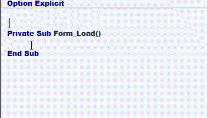



## API/constants/types  autopaste addin \(resubbmitted without the large avi files\)

### Description

THIS PROGRAM IS A VB ADDIN THAT SIMPLIFIES AND QUICKENS THE

PROCESS OF INSERTING API DECLARATIONS AS WELL AS THEIR ASSOCIATED

CONSTANTS AND TYPES IN YOUR PROJECT.

HERE IS HOW IT WORKS:

1) FOR API DECLARATION INSERTION:

type out the api call i.e  "setwindowpos"

(without the quotes)

select or highlight the call with your mouse

cursor, and with the left button still pressed

down hit the "a" key on the keyboard.

2) FOR CONSTANTS INSERTION

(a) if you know the constants you want

type out the first 3 letters ( or more) of

the constant(s) you wish to insert.

For example..say you've just inserted the

api call "DrawText" which requires at least

on of the constants prefixed with "DT_

i.e "DT_LEFT or "DT_SINGLELINE"

Type out "dt_" (without the quotes)

select it with your mouse and with the left

button still down hit the "c" key

select the constants you desire from the

alphabetical list

(b) If your unsure of the constants you want

with the left mouse button pressed anywhere

in the code window

hit the "c" key

select the constants you desire from the

alphabetical list

3) FOR TYPE INSERTION

(a) if you know the type you desire

type out the entire types name i.e. "pointapi"

(without the quotes)

select it with your mouse, with the left button

still down hit the "t" key, confirm your selection

(b) if your usure of the constants you desire

with the left mouse button depressed anywhere

in the code window, hit the "t"

key.

The entire list of constants is displayed in

alphabetical order.

Make your selection(s)
 
### More Info
 

             |
---                |---
**Submitted On**   |2005-03-24 18:36:58
**By**             |[Evan Toder](https://github.com/Planet-Source-Code/PSCIndex/blob/master/ByAuthor/evan-toder.md)
**Level**          |Intermediate
**User Rating**    |5.0 (10 globes from 2 users)
**Compatibility**  |VB 4\.0 \(32\-bit\), VB 5\.0, VB 6\.0
**Category**       |[Custom Controls/ Forms/  Menus](https://github.com/Planet-Source-Code/PSCIndex/blob/master/ByCategory/custom-controls-forms-menus__1-4.md)
**World**          |[Visual Basic](https://github.com/Planet-Source-Code/PSCIndex/blob/master/ByWorld/visual-basic.md)
**Archive File**   |[API\_consta1867723242005\.zip](https://github.com/Planet-Source-Code/evan-toder-api-constants-types-autopaste-addin-resubbmitted-without-the-large-avi-files__1-59626/archive/master.zip)

